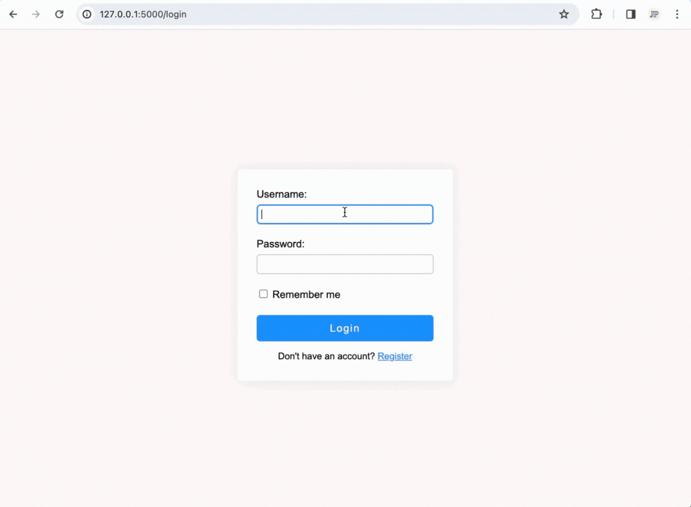

# Flask Login System

This repository contains the example website I've developed to accompany my article on [creating a secure Flask login system](https://jacobpadilla.com/articles/Python-Flask-Login-System).

<p align="center">
    
</p>


## Quick Start Guide

Interested in trying it out for yourself? Follow these steps to get the system up and running on your local machine:

1. **Clone the Repository**
   ```
   $ git clone https://github.com/jpjacobpadilla/Flask-Login-System
   $ cd Flask-Login-System
   ```

2. **Create and Activate a Virtual Environment**
   ```
   $ python -m venv venv
   $ source venv/bin/activate
   ```

3. **Install Required Dependencies**
   ```
   $ pip install -r requirements.txt
   ```

4. **Navigate to the Source Directory**
   ```
   $ cd src
   ```

5. **Launch the Application**
   ```
   $ python app.py
   ```

After completing these steps, the Flask application should be running locally on your machine. Feel free to explore the code and the functionalities of the Flask login system.
